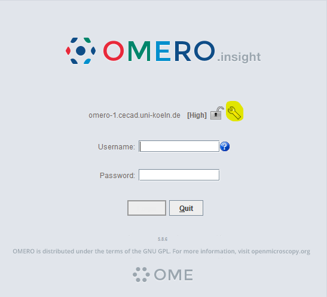

# image analysis
This project is for students in the Neurobiochemistry Module ([SoSe26] Neurobiochemistry (MN-BC-SM08)) at the University of Cologne.

## overview
In a few days we will take a practical approach and learn basics of microscopy image display and automated image analysis. We will be using OMERO and Python for our approach and get to know key concepts in digital image processing.

## display publication ready microscopy images using Omero
The images you have acquired have been deposited on a server that is hosted by CECAD. To access this server directly from your computer, you need to download the software OMERO.insight, which you can find for your operating system by clicking on the badge below:

Once the software is downloaded and installed, run the software and you should see something that looks like this:

When you click on the wrench symbol (see above highlighted in yellow) add the following server name: 

**omero-1.cecad.uni-koeln.de**

Afterwards attempt to login using your uniKIM credentials. I will manually add you to the Neurobiochemistry Course and you will have access to your data from the confocal microscope sessions.

You can access the Omero webclient directly in your browser by clicking on the badge below:

## notebooks
| # | Notebook | Description | Link |
|---|----------|-------------|------|
| 1 | first notebook  | new to Python? check out these basic functions... |  |
| 2 | images in Python  | load and display a simple tif image |  |
| 3 | images in Python  | load and display a .lif file |  |
| 4 | images in Python  | image processing basics |  |
| 5 | images in Python  | image processing advanced |  |
| 6 | images in Python  | pixel classification |  |

## requirements
We will be using various packages that have been developed by others. 
